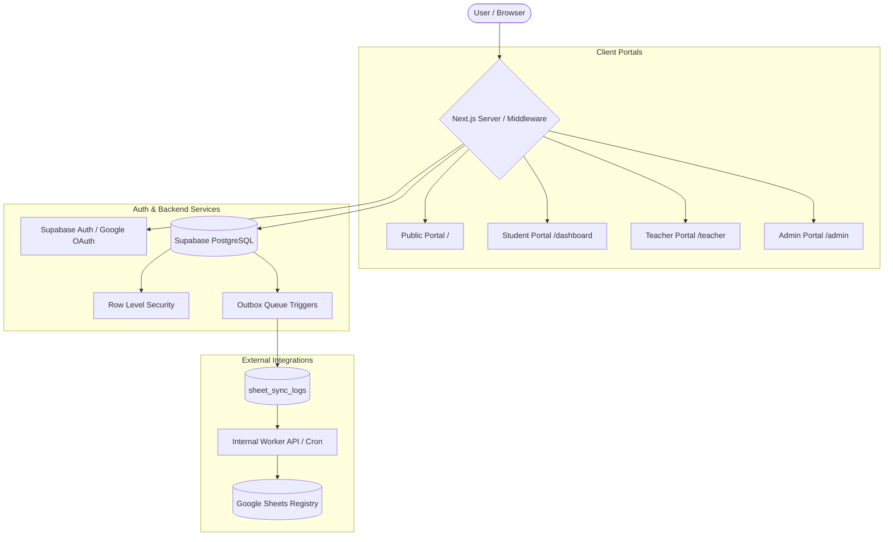

# IoT Club Learning, Innovation & Lab Management Platform

> **We Learn. We Build. We Innovate.**

A modern, production-ready digital operating system for university IoT clubs covering the entire student journey:
**Discover → Apply → Get Selected → Learn → Practice → Build → Lab Inventory → Collaborate → Compete → Get Certified → Mentor Others**

---

## 1. Overview & Purpose

The **IoT Club Platform** is an enterprise-grade digital portal engineered to streamline the operations, learning tracks, hardware inventory, and administrative workflows of college technology clubs. 

Built with **Next.js 15+ (App Router)**, **TypeScript**, **Tailwind CSS**, and **Supabase (PostgreSQL)**, the system unites public club discovery, authenticated student portfolios, faculty evaluation centers, and administrative membership management into a single, high-performance platform.

---

## 2. System Architecture & Portals



### Supported Portals & Roles:
1. **Public Website (`/`)**: Club showcase, technical domain specializations (Embedded Systems, Networking, AIoT, Robotics, Cloud, Security), hardware showcases, and certificate verification (`/verify`).
2. **Student Portal (`/dashboard`, `/learn`, `/projects`, `/lab`)**: Student dashboard, structured LMS learning tracks, prerequisite skill trees, XP and badges, hardware borrowing requests, team formation boards, and monthly innovation challenges.
3. **Teacher & Mentor Portal (`/teacher`)**: Assignment evaluation center with multi-criteria rubric sliders, hardware checkout approvals, cohort skill analytics, and dynamic QR attendance token generation.
4. **Admin Portal (`/admin`, `/admin/membership`)**: Real-time membership management with status filtering, multi-column search, pagination, detailed modal inspection, audit history, and Google Sheets synchronization controls.
5. **Lab Management (`/lab`, `/lab/live`)**: Asset tracking with QR code resolution (`/lab/assets/[assetId]`), inventory control, and live lab telemetry streams.

---

## 3. Technology Stack

- **Framework**: Next.js 15.5+ (React 19, App Router, Server Components, Server Actions)
- **Language**: TypeScript (Strict type checking)
- **Styling**: Tailwind CSS, Lucide Icons, clsx, tailwind-merge
- **Database & Auth**: Supabase (PostgreSQL 17), Supabase Auth (Email/Password, Google OAuth 2.0), Row Level Security (RLS)
- **External Integration**: Google Sheets API v4 (Service Account JWT authorization, outbox queue pattern)
- **Runtime & Deployment**: Vercel (Edge Middleware, Serverless Functions), Supabase Cloud

---

## 4. Authentication & Membership Lifecycle

### Authentication Architecture
- Dual-mode authentication via **Email/Password** and **Google OAuth 2.0**.
- Centralized server-side route resolver (`lib/auth/server.ts`) directing users authoritatively:
  - Unauthenticated → `/login`
  - Registered without approved membership → `/membership/status`
  - Approved Student → `/dashboard`
  - Faculty / Mentor → `/teacher`
  - Administrator → `/admin`

### Membership State Machine
```
[Registration] ──► PENDING ──► APPROVED ──► SUSPENDED
                       │            ▲           │
                       │            └───────────┘ (Reactivate)
                       ▼
                    REJECTED (Terminal)
```
- **Strict Database Transitions**: Handled via `review_membership_application` PostgreSQL RPC.
- **Concurrency Control**: Protected with `SELECT ... FOR UPDATE` row locking.
- **Audit Logging**: Every state change writes immutable records to `public.audit_logs`.
- **Mandatory Rationales**: Administrative notes required for `REJECTED` and `SUSPENDED` decisions.

---

## 5. Google Sheets Integration

The platform features an automated, transactional outbox pattern to mirror registrations to an external administrative Google Spreadsheet:
1. **Source of Truth**: PostgreSQL is the single source of truth.
2. **Outbox Trigger**: Inserting or reviewing an application queues a `PENDING` entry in `public.sheet_sync_logs`.
3. **Dedicated Worker Secret**: Worker endpoints (`/api/internal/google-sheets/sync`) require `INTERNAL_SHEETS_SYNC_SECRET` (distinct from database credentials).
4. **Self-Sync Route**: Students can securely trigger an update of their own record at `/api/internal/google-sheets/sync/self` without exposing global worker capabilities.
5. **In-Place Updates**: Ensures zero duplicate rows; existing registration rows are located by Registration ID and updated in place.

---

## 6. Security Model

- **Row Level Security (RLS)**: Enforced across all public tables (`profiles`, `membership_applications`, `student_profiles`, `audit_logs`, etc.).
- **Server Guards**: Administrative and teacher pages perform server-side session and role validation before rendering.
- **Search Path Hardening**: All `SECURITY DEFINER` database functions execute with `set search_path = ''`.
- **Sanitized Redirects**: Open-redirect protection sanitizes callback URLs against allowlists.
- **Secret Isolation**: Clear separation between public anon keys, server-side service role keys, internal worker secrets, and Google service account keys.

---

## 7. Local Development Setup

### Prerequisites
- **Node.js**: v20.x or v22.x
- **Docker Desktop**: Required for local Supabase containers
- **Git**

### Installation

1. **Clone the repository**:
   ```bash
   git clone https://github.com/haridharanesh-official/IoT_Club.git
   cd IoT_Club
   ```

2. **Install dependencies**:
   ```bash
   npm ci
   ```

3. **Start local Supabase stack**:
   ```bash
   npx supabase start
   ```

4. **Initialize database schema & synthetic seeds**:
   ```bash
   npx supabase db reset
   ```

5. **Configure environment variables**:
   ```bash
   cp .env.example .env.local
   ```
   Fill in local credentials obtained from `npx supabase status`.

6. **Start Next.js development server**:
   ```bash
   npm run dev
   ```
   Access the application at `http://localhost:3000`.

---

## 8. Environment Variables

Reference template is provided in [`.env.example`](.env.example):

| Variable | Description | Exposure |
| :--- | :--- | :--- |
| `NEXT_PUBLIC_APP_URL` | Canonical app URL (`http://localhost:3000` or production domain) | Public |
| `NEXT_PUBLIC_SUPABASE_URL` | Supabase API URL | Public |
| `NEXT_PUBLIC_SUPABASE_PUBLISHABLE_KEY` | Supabase anon/publishable key | Public |
| `SUPABASE_SERVICE_ROLE_KEY` | Supabase service-role key (server operations only) | Server Only |
| `GOOGLE_SHEETS_SPREADSHEET_ID` | Google Sheets target spreadsheet ID | Server Only |
| `GOOGLE_SHEETS_REGISTRATION_TAB` | Tab name for registration records | Server Only |
| `GOOGLE_APPLICATION_CREDENTIALS` | Path to service account JSON key (local dev) | Server Only |
| `GOOGLE_SERVICE_ACCOUNT_KEY` | Inline JSON or base64 service account key (production) | Server Only |
| `SUPABASE_AUTH_EXTERNAL_GOOGLE_CLIENT_ID` | Google Cloud OAuth Web Client ID | Server Only |
| `SUPABASE_AUTH_EXTERNAL_GOOGLE_SECRET` | Google Cloud OAuth Client Secret | Server Only |
| `INTERNAL_SHEETS_SYNC_SECRET` | Secret token authenticating background sync worker | Server Only |

---

## 9. Testing & Quality Assurance

The project contains a comprehensive automated regression suite:

```bash
# Run core registration & audit regression suite
node tests/audit-runner.mjs

# Run Google Sheets outbox & concurrency test
npx jiti tests/google-sheets-outbox.ts

# Run Google OAuth routing and destination tests
npx jiti tests/oauth-routing.ts

# Run automatic Sheets sync & outbox recovery test
npx jiti tests/automatic-sync-phase-08-2.ts

# Run endpoint hardening & RBAC security suite
npx jiti tests/phase-08-3-hardening.ts

# Run dedicated worker secret isolation test
npx jiti tests/phase-08-4-dedicated-secret.ts

# Run complete Phase 09 real admin membership test suite
npx jiti tests/admin-membership-phase-09.ts

# Run static type checking
npm run typecheck

# Run ESLint validation
npm run lint

# Build production bundle
npm run build
```

---

## 10. Project Structure

```
├── app/                        # Next.js App Router routes
│   ├── admin/                  # Protected Admin & Membership review portal
│   ├── api/                    # API routes (internal sync, audit)
│   ├── auth/                   # Authentication callbacks and account pages
│   ├── dashboard/              # Student dashboard
│   ├── lab/                    # Hardware inventory & telemetry
│   ├── learn/                  # LMS tracks & skill trees
│   ├── projects/               # Projects & team recruitment
│   └── teacher/                # Mentor evaluation center
├── components/                 # UI components by domain
│   ├── admin/                  # Admin portal & review modals
│   ├── layout/                 # Navbar, banner, footer
│   └── student/                # Student dashboard views
├── docs/                       # Architectural specifications & audits
├── lib/                        # Domain logic, store, and utilities
│   ├── admin/                  # Admin data access & metrics
│   ├── auth/                   # Session verification & route resolution
│   └── integrations/           # Google Sheets adapter & outbox drain
├── supabase/                   # Supabase configuration & migrations
│   ├── migrations/             # Timestamped SQL schema migrations
│   └── seed.sql                # Deterministic synthetic test seed
├── tests/                      # End-to-end integration and security test suites
├── utils/                      # SSR Supabase client utilities
└── .env.example                # Safe environment variable template
```

---

## 11. Deployment Architecture

- **Frontend & Edge API**: Hosted on **Vercel** with automatic preview deployments on Pull Requests.
- **Database**: **Supabase Cloud** PostgreSQL instance with automated backups and connection pooling.
- **Background Cron**: Scheduled invocation of `/api/internal/google-sheets/sync` via Vercel Cron or Cloud Scheduler using `INTERNAL_SHEETS_SYNC_SECRET`.
- **Identity Provider**: Google Cloud OAuth 2.0 Client credentials linked to Supabase Auth.

---

## 12. Contributing & Security Reporting

### Contributing
1. Fork or branch from `main`.
2. Ensure all changes include corresponding tests under `tests/`.
3. Verify that `npm run typecheck`, `npm run lint`, and all test suites pass cleanly.
4. Submit a Pull Request targeting `main`.

### Security Guidance
If you discover a potential security vulnerability, please do NOT create a public issue. Instead, report it directly to the platform administrators or faculty mentors at `security@iotclub.example`.

---

## 13. License

This project is open source and available under the [MIT License](LICENSE).
